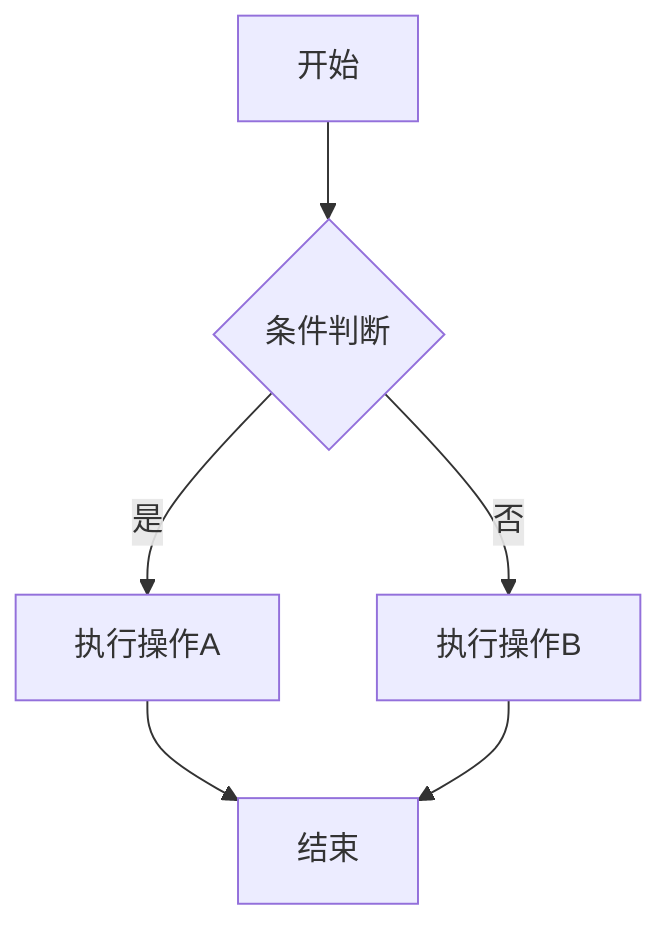
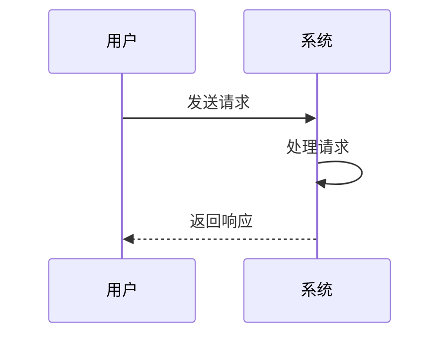

# 测试文档

这是一个用于测试 MarkdownLite 的示例 Markdown 文件。

## 功能特性

- 支持 GitHub 风格的 Markdown 渲染
- 左侧目录导航
- 文件刷新功能

## 代码示例

```javascript
function hello() {
  console.log("Hello, MarkdownLite!");
}
```

## 表格测试

| 名称 | 描述 |
|------|------|
| MarkdownLite | 本地 Markdown 查看器 |
| Express | Web 框架 |

## 二级标题 A

一些内容...

### 三级标题 A1

更多内容...

### 三级标题 A2

更多内容...

## 二级标题 B

结尾内容。

## 流程图示例



## 时序图示例


